#Source

This is a writeup for the room "Source" by DarkStar7471 at TryHackMe.

All my screenshots have the IP I was given while I did the room 10.10.113.103 
Make sure you use the IP you receive once you deploy the machine.

I hope you enjoy! ♪(๑ᴖ◡ᴖ๑)♪

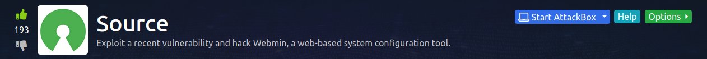

This room doesn't give us hints at all, so let's just start by a nmap scan

`nmap -sC -A -T 4 IP`

Quick explanation on the switches used here:
-sC runs all the NSE default scripts. 
-A agressive scan
-T4 to speed things up 

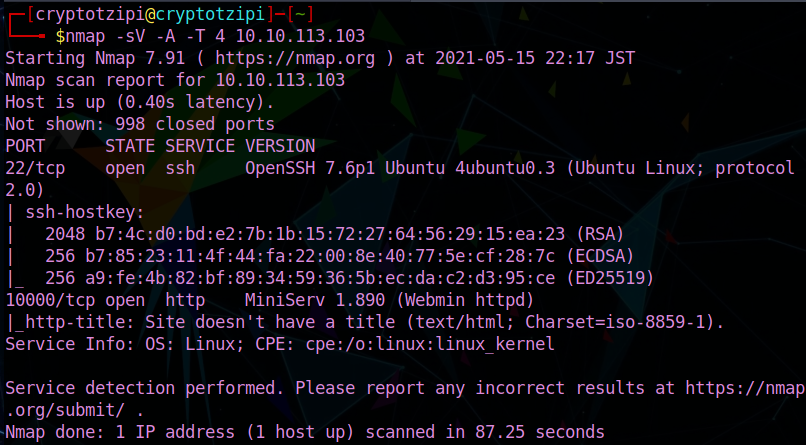

We find port 22 open, which is SSH ...
And a high port 10000 TCP running some kind of web server/service ...

Let's just check it out in our browser!

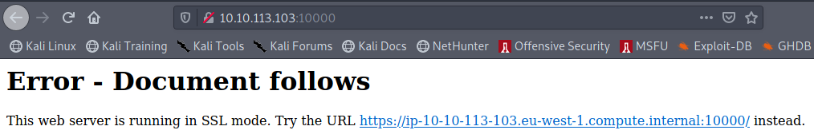

OK, here, I did try just clicking on the link as the explanation says, but it would NOT connect.
I tried it on Chromium (I use Firefox) and it didn't work either (๑´╹‸╹`๑)

I was about to check one of the few writeups existent in the room or reset the machine, but 
I thought of trying something first! I added https:// to 10.10.113.103:10000 (your IP will be different!!)...

And it WORKED!! ٩(^ᴗ^)۶

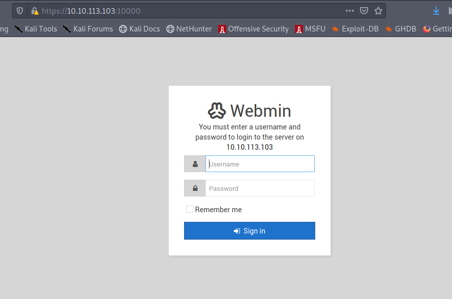

Webmin authentication/login page ...

But we don't have any credentials (haha... I did try admin:admin ... user:password ...and maybe 10 other common combinations and those did not work)

Checked the page source, nothing there as well.

Maybe there is a way of exploiting this Webmin... let's search at [Exploit-DB](https://www.exploit-db.com/)

(using `searchsploit webmin` in the terminal works too!!)

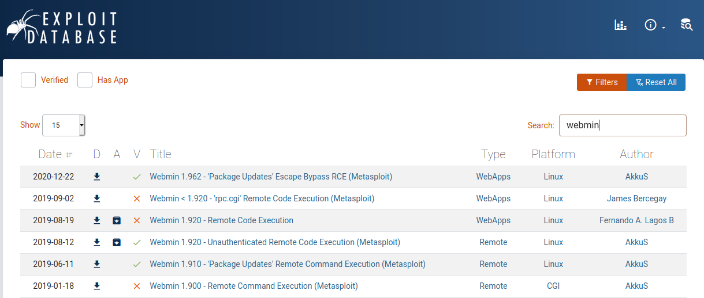

As we can see, there are a few exploits there ... and the majority mention Metasploit soooooo....

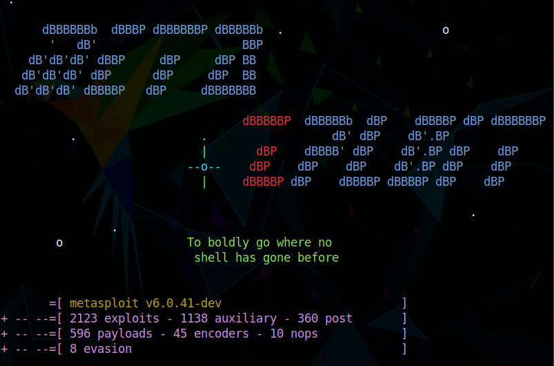

Sorry, Offensive Security... I LOVE Metasploit and the banners are always cool!

OK, so let's do a 

`search webmin` and see what we can find and use ...

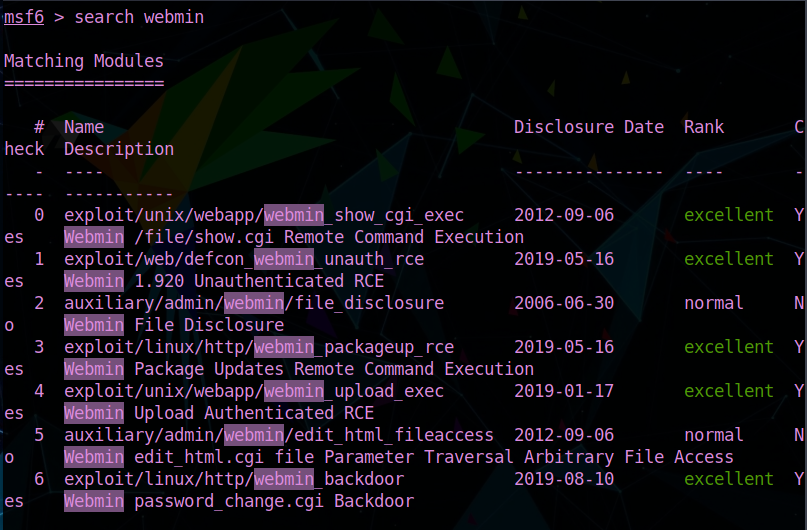

Nice... going through all of them, let's pick the backdoor and try to sneak our way into that machine

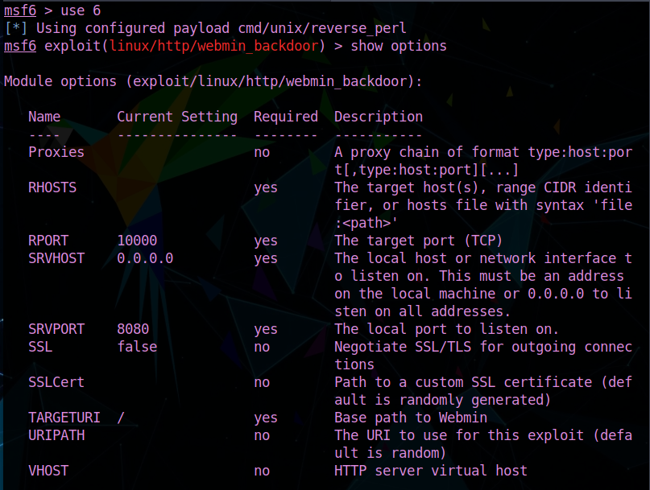 

`use 6` then `show options`

Here we need to set the RHOST (remote host... that's the victim, the machine we're hacking into)

SSL (for those who might not be familiar, this stands for Secure Socket Layer ... remember at the beginning we had to add https:// to be able to access the web server? It wouldn't work with an unsecure connection!!) to TRUE

LHOST (local host.. that's us, but make sure to set the IP TryHackMe gave you through the openvpn if you're using your own system, or the IP of the attack box, if you are using the in browser machine!)

After setting everything and making sure there are no mistakes, just type `run` or `exploit`

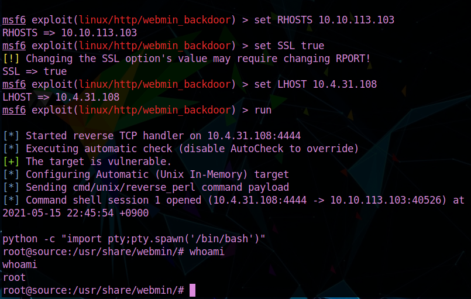

Not only our exploit worked and we got a shell ...

(make sure to stabilize it by typing `python -c "import pty;pty.spawn('/bin/bash')"` )

We are root!!

SWEET!!
So all we got to do is go find our flags!!!!!

For user.txt

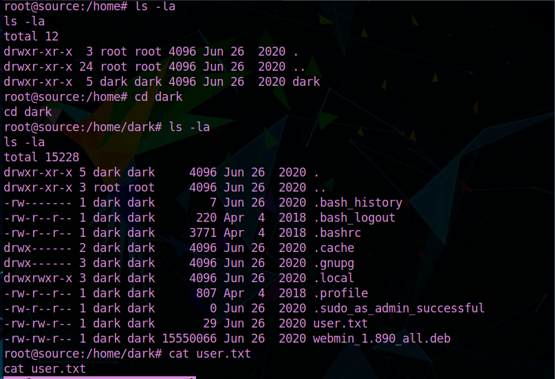

For root.txt

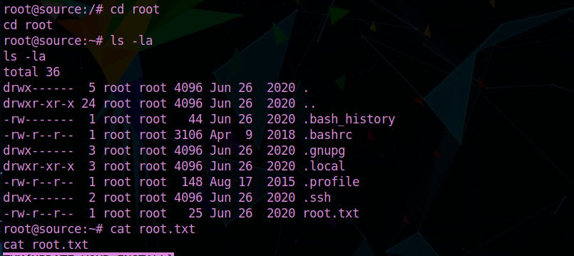
 

And we are DONE!!!!!!!!!!!!!!! ٩(๑❛ᴗ❛๑)۶

I hope you enjoyed hacking this machine and thank you SO much for using/reading my writeup!!

Keep on learning, keep on hacking!!

                                    `CryptoTzipi aka CyberLola`

